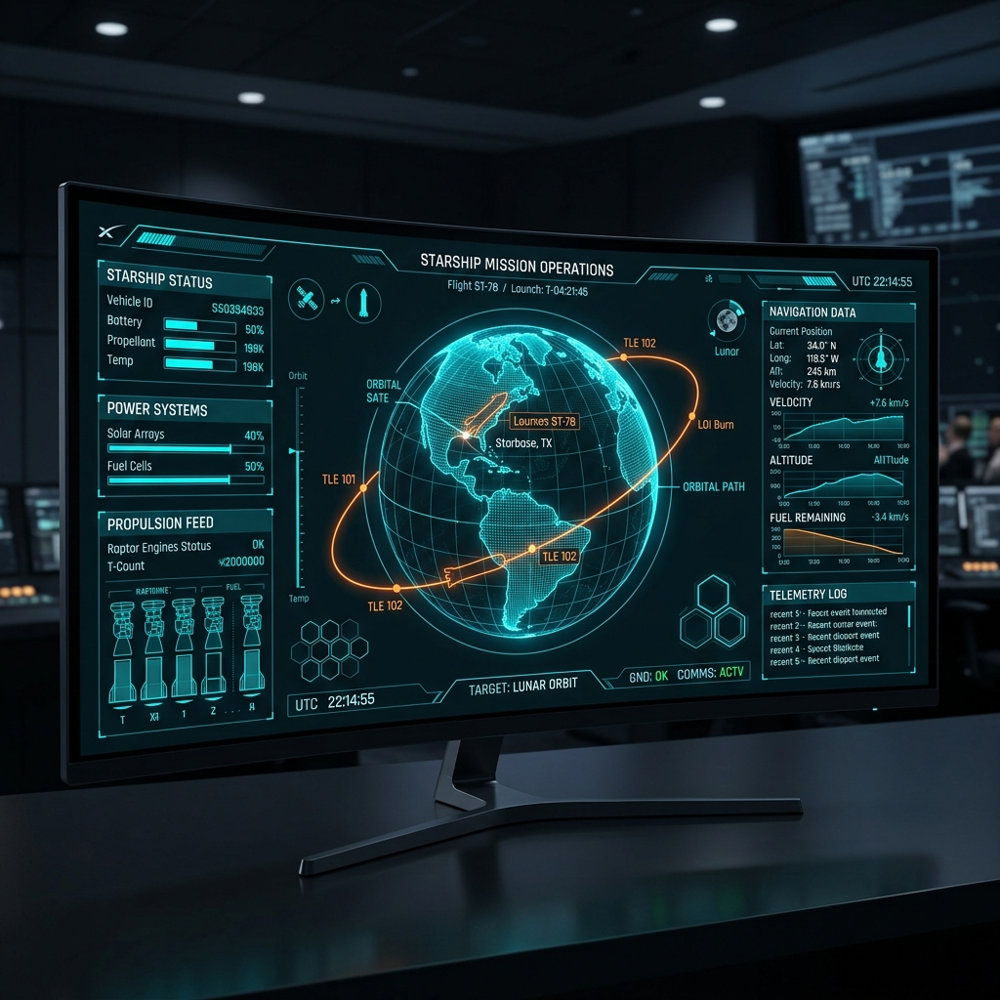
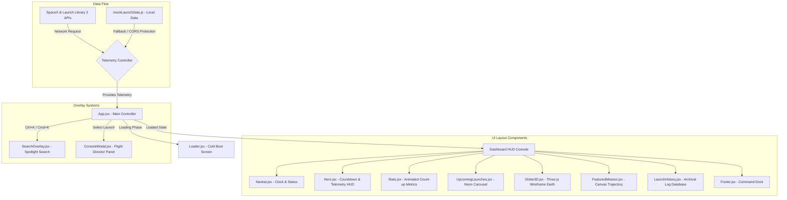

<p align="center">
  
</p>

# 🛰️ OBSIDIAN HUNT // Mission Control Center
<p align="center">
  <strong>A Premium, High-Fidelity Aerospace Operations Dashboard & Telemetry Visualizer</strong>
</p>

<p align="center">
  
  
  
  
  
</p>

<p align="center">
  🔗 <strong>Live Mission Console Feed</strong>: <a href="https://obsidian-hunt.netlify.app/">obsidian-hunt.netlify.app</a>
</p>

---

## 📌 Mission Objective

**Obsidian Hunt** is an immersive, high-fidelity aerospace flight operations dashboard and interactive telemetry console. Inspired by modern SpaceX Starbase and NASA Mission Control rooms, it bridges the gap between raw data and creative front-end execution. 

This platform showcases real-time telemetry coordinates, orbital flight paths, 3D WebGL visualizations, and dynamic canvas graphs — all coordinated through a reactive, state-driven dashboard system.

> [!TIP]
> **Recruiter & Reviewer Quick-Start**: The system features a built-in hybrid API fail-safe network. If live SpaceX or Launch Library 2 APIs encounter CORS limits or network timeouts, the dashboard automatically routes data to the high-fidelity local database. **Uptime is guaranteed at 100%**.

---

## 🌐 System Architecture

The application utilizes a modular, state-driven model where the main application context handles modals, global timing, and active telemetry feeds, while components update using optimized local loops.



---

## ✨ Core System Features

### 1. `Loader.jsx` | Cold Boot Simulator
- Simulates an OS boot sequence by dynamically printing aerospace terminal messages (e.g., `Initializing telemetry grids...`, `Synchronizing orbital clocks...`).
- Animates a progress bar and percentage value (0% to 100%) before performing a sliding exit transition.

### 2. `Globe3D.jsx` | WebGL 3D Planetary Radar
- Renders an interactive, responsive 3D Earth using **Three.js** with custom wireframe textures and grids.
- Plots global launch sites (Vandenberg, Cape Canaveral, Satish Dhawan Space Centre, etc.) based on geodesic latitude/longitude coordinates.
- Projects glowing bezier curves representing active launch trajectory arcs.
- Supports user orbit control drag/zoom interactions and click raycasting to trigger info overlays.

### 3. `Hero.jsx` & `Stats.jsx` | Flight Cockpit HUD
- **Live Countdown Clock**: Renders down to the millisecond, calculating time remaining to the nearest global launch.
- **Dynamic Telemetry Gauges**: Simulates real-time aerospace mechanics (Speed, Altitude, Pitch, Yaw, Roll) vibrating and fluctuating every 150ms to emulate real rocket ascents.
- **Animated Counter Panels**: Counts up from zero as stats enter the viewport, showcasing total flights, success rates, and active programs.

### 4. `UpcomingLaunches.jsx` | Mission Carousel
- Renders upcoming international flights in a horizontal glassmorphic carousel.
- Features a custom neon hover state and independent ticking countdown timer on each card.

### 5. `FeaturedMission.jsx` | Trajectory Graph
- Renders a featured flight card containing a real-time **HTML Canvas** apogee graph.
- Generates dynamic math-driven coordinates mapped onto canvas pixels with simulated telemetry noise.

### 6. `SearchOverlay.jsx` | Spotlight Command Search
- Built-in global keyboard listener (`Cmd+K` / `Ctrl+K`) that reveals a high-tech navigation modal.
- Allows instant searching across rocket models, staging areas, and active launch pads.

### 7. `ConsoleModal.jsx` | Flight Director Desk
- Activated by clicking on any launch mission, revealing a multi-gauge command desk.
- Displays sequential checklist staging phases (Propellant Load, Guidance Lock, Max Q, Orbit Insertion).
- **Telemetry Simulator Actions**:
  - **Initiate Flight**: Resets indicators and plots a real-time velocity curve.
  - **Abort Command**: Flashes emergency red alerts, triggers CRT scanline flickering, and applies a shake vibration effect to the entire dashboard.

### 8. `ShaderBackground.jsx` | WebGL2 Cosmic Nebula Underlay
- Compiles and runs a high-performance custom fragment shader rendering fractal noise clouds and space nebulae.
- Dynamically responds to pointer events, screen size changes, and elapsed time with low-overhead animation frame loops.

### 9. `ImageReveal.jsx` | Interactive Spotlight Mask
- An advanced hover-based masking effect that reveals sharp, clear imagery under the cursor while keeping the rest blurred and dark.
- Incorporates responsive cursor radius scaling, coordinate position lerping, and a subtle glowing light leak follower.

### 10. `FlippingCard.jsx` | 3D Double-Sided Cards
- A reusable component enabling smooth 3D card flips on hover, keyboard interaction, or tap.
- Fully supports dual-faced React nodes with backface-visibility protection.

---

## 🎨 Cybernetic Theme & Design Tokens

Obsidian Hunt's design language is built around Tailwind CSS v4 custom theme tokens, generating a premium cyberpunk aerospace HUD aesthetic.

### Colors
| Swatch | Color | HEX | CSS Variable | Purpose |
| :---: | :--- | :--- | :--- | :--- |
| <span style="color:#020204; font-size:1.5rem">■</span> | Space Black | `#020204` | `--color-space-black` | Deep void canvas background |
| <span style="color:#0a0806; font-size:1.5rem">■</span> | Nebula Navy | `#0a0806` | `--color-nebula-navy` | Warm obsidian carbon charcoal panel background |
| <span style="color:#1c1511; font-size:1.5rem">■</span> | Cyber Slate | `#1c1511` | `--color-cyber-slate` | Warm slate dark-brown UI borders and inactive blocks |
| <span style="color:#ff9e00; font-size:1.5rem">■</span> | Neon Cyan | `#ff9e00` | `--color-neon-cyan` | Primary HUD accents, active state glows, and telemetry paths (re-mapped to glowing gold/amber!) |
| <span style="color:#ff4000; font-size:1.5rem">■</span> | Rocket Orange | `#ff4000` | `--color-rocket-orange` | Critical alerts, ignition trajectories, and countdown timers (fire orange-red) |

### Visual FX
- **CRT Scanline Overlay**: A repeating linear-gradient overlay loop mimicking military radar screens.
- **Starfield Parallax**: Multi-layered CSS-animated stars moving vertically at distinct speeds to simulate depth.
- **Monospace Stability**: Integrated JetBrains Mono with tabular figure styling (`font-mono`), ensuring telemetry metrics don't cause layout shifting during high-speed updates.

---

## 📁 Project Directory Tree

```text
src/
├── main.jsx              # React app mounting root
├── index.css             # Tailwind v4 configuration, CRT effects, stars, & animations
├── App.jsx               # Global state coodinator (loading, active launch mod, filters)
├── data/
│   └── mockLaunchData.js # High-fidelity offline backup dataset (staging checklists, vectors)
└── components/
    ├── Loader.jsx        # Boot logs terminal & progress bar
    ├── Navbar.jsx        # Translucent glassmorphic header, UTC clock, status dots
    ├── Hero.jsx          # Live launch countdown & telemetry cockpit
    ├── Stats.jsx         # Count-up panels (Launches, Success Rate, Manifests)
    ├── UpcomingLaunches.jsx # Horizontal card swipe with card clocks
    ├── FeaturedMission.jsx  # Banner and HTML Canvas telemetry graph
    ├── Globe3D.jsx       # ThreeJS 3D Earth, bezier curves, drag orbit rotations
    ├── Timeline.jsx      # Scroll-triggered upcoming milestone nodes
    ├── RocketGallery.jsx # Carousel displaying rocket specs (Falcon 9, Starship, SLS)
    ├── LaunchHistory.jsx # Searchable log database with status filters
    ├── SearchOverlay.jsx # Spotlight search overlay (Cmd+K)
    ├── ConsoleModal.jsx  # Flight controller desk (Initiate/Abort commands, shakes)
    ├── Footer.jsx        # Mobile navigation dock
    ├── FlippingCard.jsx  # Reusable 3D double-sided interactive flip card
    ├── ImageReveal.jsx   # Spotlight cursor hover reveal mask
    └── ShaderBackground.jsx # WebGL2 interactive cosmic nebula rendering canvas
```

---

## 🛠️ Local Development & Quick Start

> [!IMPORTANT]
> Make sure you have **Node.js (v18 or higher)** installed on your machine.

### 1. Clone & Enter Repository
```bash
git clone https://github.com/rahul-rrj/Obsidian-Hunt.git
cd Obsidian-Hunt
```

### 2. Install Project Dependencies
```bash
npm install
```

### 3. Spin Up Development Server
```bash
npm run dev
```
*This starts the Vite dev server. Open [http://localhost:5173](http://localhost:5173) in your browser.*

### 4. Build for Production
```bash
npm run build
```
*Compiles static assets into the `dist/` folder with optimized bundle splitting.*

---

## 🌐 Deployment Guidelines

This application is configured for continuous integration/continuous deployment (CI/CD) on Netlify.

### Netlify Settings:
- **Build Command**: `npm run build`
- **Publish Directory**: `dist`
- **Production Branch**: `main`

<p align="center">
  Developed with 🛰️ by the Obsidian Hunt Crew
</p>
